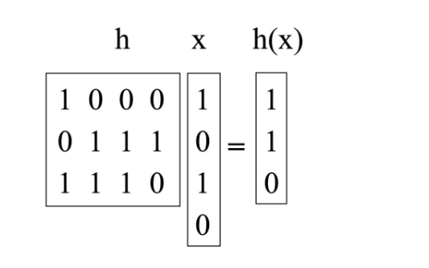

# Perfect-Hashing

Perfect Hashing is a hashing mechanism where a hash function is designed to make  all lookups be in  O(1) time complexity . The objective of perfect hashing is to create a data structure that make sure that no collisions occur when inserting or searching for elements within the hash table.

## Universal Hashing ( The Matrix Method )

technique to create hash functions that are well-distributed for any input. The class is generic to allow it to be used with any type of object.

hashing a value **(x)** and get a key **h(x)** by matrix multiplication of a random matrix h and binary representation of **(x)** to get a binary value of key **h(x).**

## O( N²) Space Solution Perfect Hashing

Allocating a hash table size based on the square of the input size **(N²)** to minimize collision probability at the cost of increased space usage. Universal hashing is used to generate the hash function

it includes these **Operations: Insert, Delete, Contains**

**collision handling:** rehash current values with different hashing function by regenerating new Random matrix h. On average, we will only need to do this twice.

## O( N ) Space Solution Perfect Hashing

Linear Space Perfect Hashing uses a two-level hash table design to achieve near-perfect hashing with space complexity linear to the number of elements, *O*(*N*). It leverages universal hashing for both levels to ensure minimal collision.

 ****it includes these **Operations: Insert, Delete, Contains, Batch Insert** 

**Collision Handling:**

- Each key is initially hashed to a bucket in the first-level hash table. The size of each second-level hash table is squared based on the number of collisions in its respective bucket, minimizing the need for rehashing.
- When collisions occur at the second level, the hash function for that specific bucket is regenerated until a collision-free arrangement is found. This is statistically efficient due to the self-adjusting size of second-level tables.

## **Comparison between** O(N²) & O( N ) Space Solution

## **Mean time calculation**

The **`MeanTime`** class facilitates the evaluation of Perfect Hashing algorithms by generating random arrays of varying sizes and calculating the mean time required to insert/search them.  in addition to number of collisions .It offers the following functions:

1. **generateRandomArray**:
    - Generates a random array of integers with the specified size.
2. **calculateMeanSearchTime**:
    - Computes the mean time taken to search after insertion to specified Hash algorithm .
3. **calculateMeanInsertionTime**:
    - Computes the mean time taken to insert values to specified Hash algorithm .
4. **calculateCollisions**:
    - Computes the number of Collisions while inserting to specified Hash algorithm .

## Mean Insertion Time Comparison (MS)

| Array Size | O( N ) Space Time  |  O( N² ) Space Time  |
| --- | --- | --- |
| 10 | 0.494 | 0.132 |
| 25 | 0.502 | 0.061 |
| 50 | 0.486 | 0.157 |
| 100 | 0.730 | 0.299 |
| 250 | 1.610 | 0.624 |
| 500 | 2.969 | 2.013 |
| 1000 | 5.148 | 4.483 |
| 2500 | 15.631 | 17.998 |
| 5000 | 45.142 | 50.503 |
| 10000 | 160.021 | 164.603 |
| 15000 | 297.629 | 291.018 |
| 25000 | 728.675 | 653.690 |
| 30000 | 1045.082 | 950.531 |

## Mean Search For an element Time Comparison (MS)

| Array size | O( N ) Space Time |  O( N² ) Space Time  |
| --- | --- | --- |
| 10 | 0.005 | 0.001 |
| 25 | 0.003 | 0.001 |
| 50 | 0.050 | 0.001 |
| 100 |  0.001 | 0.001 |
| 250 | 0.003 | 0.001 |
| 500 |  0.001 | 0.002 |
| 1000 |  0.001 | 0.001 |
| 2500 | 0.003 | 0.001 |
| 5000 |  0.001 | 0.001 |
| 10000 | 0.003 | 0.002 |
| 15000 | 0.002 | 0.001 |
| 25000 | 0.002 | 0.002 |
| 30000 | 0.001 | 0.002 |

## Collisions Comparison

| Array size  |  O( N ) Space Collisions  |  O( N² ) Space collisions  | O( N ) Space Time average collisions per 100 iterations | O( N² ) Space Time average collisions per 100 iterations |
| --- | --- | --- | --- | --- |
| 10 | 0 | 2 | 0.870 | 0.400 |
| 25 | 6 | 0 | 2.840   | 0.550 |
| 50 | 5 | 1 |  4.810 | 0.800 |
| 100 | 3 | 2 | 6.030  |  0.750 |
| 250 | 14 | 1 | 6.430  | 0.640 |
| 500 | 8 | 0 | 6.690 | 0.670 |
| 1000 | 5 | 0 | 6.590   | 0.830 |
| 2500 | 9 | 0 |  6.730 | 0.730 |
| 5000 | 9 | 0 | 6.870 |  0.620 |
| 10000 | 11 | 1 | 6.970  | 0.440 |
| 15000 | 8 | 0 | 5.490 | 0.280 |
| 25000 | 4 | 0 | 4.350  | 0.300 |
| 30000 | 3 | 0 | 3.190  | 0.180 |

## English Dictionary

This application is a simple English dictionary implemented using perfect hashing. It provides functionalities to initialize the dictionary, insert new words, delete existing words, and search for words.

### Operations

- **Initialize:** Takes the name of the type of the backend perfect hashing as an
input and creates a new empty dictionary based on it.
- **Insert:** Takes a single string key and tries to insert it.
- **Delete:** Takes a single string key and tries to delete it.
- **Search:** Takes a single string key, searches for it, and returns true if it exists and false
otherwise.
- **Batch insert:** Takes a path to a text file containing multiple words each in a separate line.
And tries to insert all that words into the dictionary.
- **Batch delete**: Takes a path to a text file containing multiple words each in a separate
line. And tries to delete all that words from the dictionary.

## **Command Line Interface**

1. **Initialize:**
    - Accepts the type of the backend perfect hashing (O(N) or O(N²)) as an initial input.
    - Creates a new empty dictionary based on the selected hashing type.
2. **Insert:**
    - Allows the user to insert a single string key into the dictionary.
    - Prints a confirmation message if the insertion is successful.
    - Informs the user if it already exists in the dictionary.
3. **Delete:**
    - Enables the user to delete a single string key from the dictionary.
    - Prints a confirmation message if the deletion is successful.
    - Informs the user if the string doesn't exist in the dictionary.
4. **Search:**
    - Allows the user to search for a single string key in the dictionary.
    - Prints whether the string exists in the dictionary or not.
5. **Batch Insert:**
    - Supports inserting a list of strings from a text file into the dictionary.
    - Prints the number of newly added strings and the number of already existing ones.
6. **Batch Delete:**
    - Facilitates deleting a list of strings from a text file from the dictionary.
    - Prints the number of deleted strings and the number of non-existing ones.
7. **Number of Rehashing/Rebuild Due to Collisions:**
    - The CLI displays the number of rehashes due to collisions after each operation, providing insights into the efficiency of the hashing function and collision resolution strategy, which helps in if the user wants to compare between the two types of perfect hashing O(N) / O(N**²**).
8. **Number of Current Items in Dictionary:**
    - After every operation, the CLI prints the total number of items currently stored in the dictionary, offering users visibility into the size of the dictionary and the impact of their operations.
- ***Sample Runs:***

## **Java Unit Testing**

### Dictionary Tests

- **Insert And Search**: Inserts elements into the dictionary and checks if they can be found.
- **Search After Deleting**: Inserts elements, deletes them, and verifies they cannot be found.
- **Number Of Hits When Insert Successful**: Checks the change in size of the dictionary when insertion is successful.
- **Number Of Misses When Insert Failed**: Verifies the change in size when insertion fails due to duplicates.
- **Number Of Hits When Delete Successful**: Checks the change in size when deletion is successful.
- **Number Of Misses When Delete Fails**: Verifies the change in size when deletion fails due to elements not present.

### Perfect Hashing Tests

- **Table Size**: Checks the size of the hash table.
- **Insert With Integers**: Inserts unique random integers and checks the count.
- **Insert With Strings**: Inserts strings and checks the count.
- **Ignore Duplicates With Integers**: Ignores duplicates when inserting integers.
- **Ignore Duplicates With Strings**: Ignores duplicates when inserting strings.
- **Lookup When Key Exists With Integers**: Checks existence of existing keys with integers.
- **Lookup When Key Exists With Strings**: Checks existence of existing keys with strings.
- **Lookup When Key Does Not Exist With Integers**: Checks non-existence of non-existing keys with integers.
- **Lookup When Key Does Not Exist With Strings**: Checks non-existence of non-existing keys with strings.
- **Delete With Integers**: Deletes integers from the hash table.
- **Delete With Strings**: Deletes strings from the hash table.
- **Delete When Key Does Not Exists With Integers**: Deletes non-existing keys with integers.
- **Delete When Key Does Not Exists With Strings**: Deletes non-existing keys with strings.
- **Rehash With Integers**: Rehashes the hash table with integers.
- **Rehash With Strings**: Rehashes the hash table with strings.
- **Rehash After Some Delete Then Insert**: Rehashes after deleting and inserting keys.
- **Insert Till Hash Table Is Full After Rehash**: Inserts keys until the hash table is full after rehashing.
- **Number Of Times Needed To Rebuild Hash Table**: Tests the number of times needed to rebuild the hash table.
- **Number Of Times Needed To Rebuild Hash Table Large Input**: Tests the number of times needed to rebuild with large input.

## **Contributors**

- AbdElRahman Bassam 
- AbdElRahman Osama 
- Ahmed Youssef
- Mohamed Mahfouz 
- Mourad Mahgoub 
